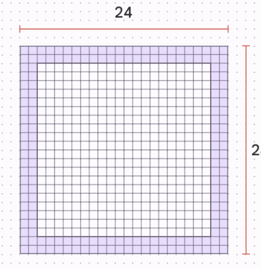
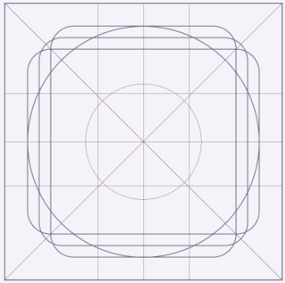
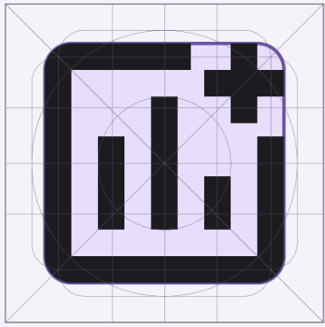
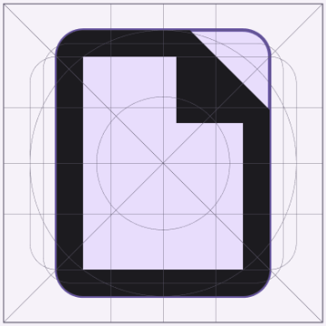
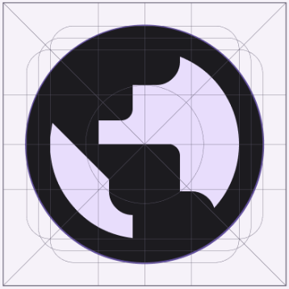
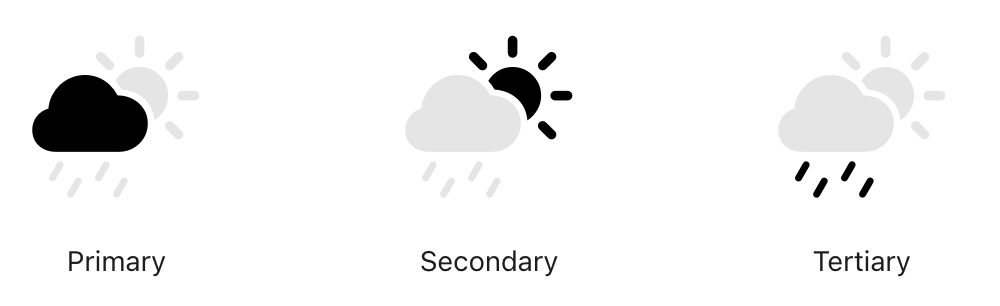
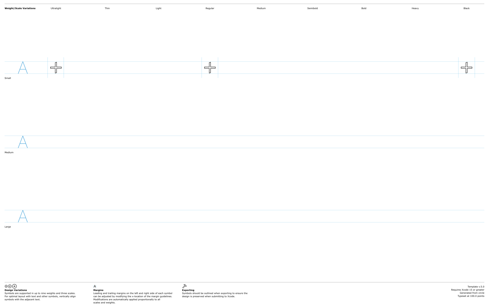
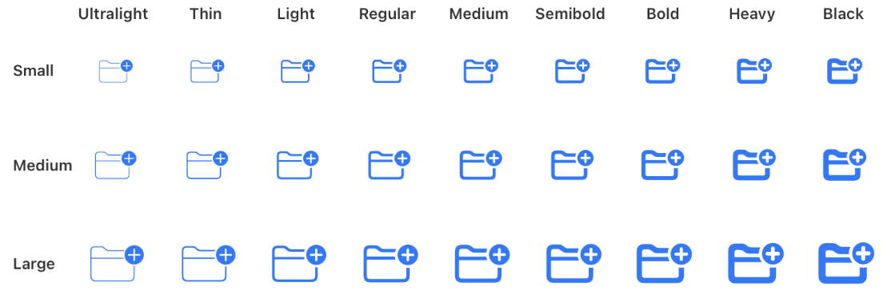
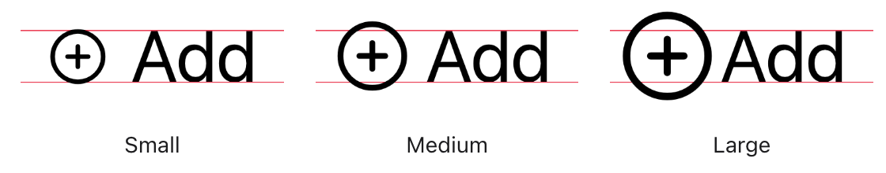

# SFSymbol Icon Convertor

Given a SVG icon with viewBox that respect [material icon principles](https://m3.material.io/styles/icons/designing-icons), generate appropriate SFSymbol.

## Longer rational

Designers often use the **material guidelines** to produce icon.

Inside this viewbox of 24x24px, there is a mandatory margin of 2px.  
The icon is supposed to respect a guideline.

For instance theese icons respect material guidelines:

More info here: https://m3.material.io/styles/icons/designing-icons

---

On the other side, and while it is still possible to use `svg`, Apple pushes for the use of SfSymbol.

SFSymbols have multiple benefits:
- performance
- ability to mix text and image in a proper way
- ability to do bi (or multi) color icon

More info here: 
- https://developer.apple.com/documentation/uikit/uiimage/creating_custom_symbol_images_for_your_app
- https://developer.apple.com/design/human-interface-guidelines/sf-symbols

It require the developper to take a template, and insert the icon inside, while respecting the size and the margin.

Since a few version, you can provide only three variations:
- ultralight-S
- regular-S
- black-S

And the system (UIKit, or SwiftUI) will interpolate the rest.

We provide the small, but to respect the material system, you are supposed to use the `.medium`

## Instalation and usage

`gem install sf_symbol_converter`

Then convert icon one by one:

`sf_symbol_converter convert ./input.svg output.svg`

Or batch convert:

`sf_symbol_converter batch_convert ./input_dir/ ./output_dir`